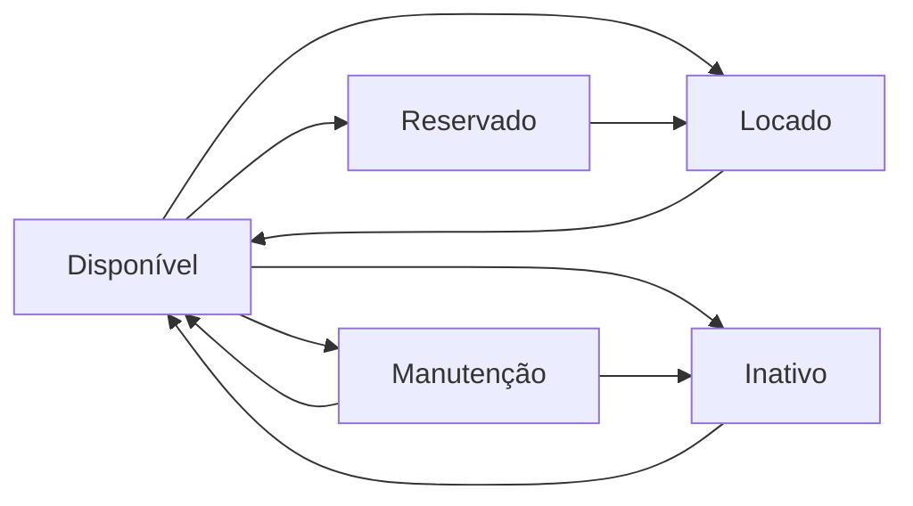

# 📚 Sistema de Gestão de Veículos - Guia Completo

## 📚 Índice
- [Visão Geral](#visão-geral)
- [Cadastro de Veículos](#cadastro-de-veículos)
- [Gerenciamento de Status](#gerenciamento-de-status)
- [Manutenções](#manutenções)
- [Disponibilidade](#disponibilidade)
- [Documentos do Veículo](#documentos-do-veículo)
- [Relatórios](#relatórios)
- [Permissões](#permissões)

---

## 📚 Visão Geral

O módulo de gestão de veículos permite controle completo da frota, desde o cadastro até o acompanhamento de manutenções, locações e disponibilidade.

### 📚 Funcionalidades Principais

✅ **Gestão Completa da Frota**
- Cadastro detalhado de veículos
- Controle de status (Disponível, Locado, Manutenção, etc.)
- Histórico de locações
- Histórico de manutenções
- Cálculo de disponibilidade

✅ **Controle Operacional**
- Quilometragem atual
- Última manutenção
- Próxima manutenção prevista
- Alertas de manutenção preventiva
- Gestão de documentos (CRLV, Seguro, etc.)

✅ **Integração**
- Sistema de locações
- Sistema de manutenções
- Sistema de relatórios
- Upload de documentos

---

## 📚 Cadastro de Veículos

### 📚 Como Acessar
**Menu Lateral ✅ Locação ✅ Veículos ✅ ✅ Novo Veículo**

OU

**URL direta:** `/Veiculos/Create`

### 📚 Campos do Formulário

#### 1📚 **Informações Básicas**

| Campo | Formato | Validação | Exemplo |
|-------|---------|-----------|---------|
| **Marca** | Texto (máx. 50 caracteres) | Obrigatório | Volkswagen |
| **Modelo** | Texto (máx. 50 caracteres) | Obrigatório | Gol 1.0 Flex |
| **Ano** | Número | Obrigatório (1990-2030) | 2023 |
| **Placa** | XXX-0000 ou XXX0X00 | Obrigatório, formato Mercosul ou antigo | ABC-1234 ou ABC1D23 |
| **Cor** | Texto (máx. 50 caracteres) | Obrigatório | Branco |

#### 2📚 **Especificações Técnicas**

| Campo | Formato | Validação | Exemplo |
|-------|---------|-----------|---------|
| **Combustível** | Seleção | Obrigatório | Gasolina, Álcool, Flex, Diesel, Elétrico, Híbrido |
| **Câmbio** | Seleção | Obrigatório | Manual, Automático, Automatizado, CVT |
| **Quilometragem** | Número inteiro | Obrigatório (✅ 0) | 45.000 |

#### 3📚 **Valores**

| Campo | Formato | Validação | Exemplo |
|-------|---------|-----------|---------|
| **Valor da Diária** | Decimal (R$) | Obrigatório | R$ 150,00 |
| **Valor de Mercado** | Decimal (R$) | Opcional | R$ 55.000,00 |

#### 4📚 **Localização e Status**

| Campo | Formato | Validação | Exemplo |
|-------|---------|-----------|---------|
| **Agência** | Seleção | Obrigatório | Agência Centro |
| **Status** | Seleção | Obrigatório | Disponível |

### 📚 Status do Veículo

| Status | Descrição | Cor | Permite Locação✅ |
|--------|-----------|-----|------------------|
| **Disponível** | Veículo pronto para locação | 📚 Verde | ✅ Sim |
| **Locado** | Veículo em locação ativa | 📚 Azul | ✅ Não |
| **Manutenção** | Veículo em manutenção | 📚 Amarelo | ✅ Não |
| **Reservado** | Veículo reservado para locação futura | 📚 Roxo | ✅ Não |
| **Inativo** | Veículo fora de operação | 📚 Vermelho | ✅ Não |

### 📚 Passo a Passo - Cadastro

1. **Acesse o formulário**
   - Menu ✅ Veículos ✅ Novo Veículo

2. **Preencha as informações básicas**
   ```
   Marca: Volkswagen
   Modelo: Gol 1.0 Flex
   Ano: 2023
   Placa: ABC1D23
   Cor: Branco
   ```

3. **Especificações técnicas**
   ```
   Combustível: Flex
   Câmbio: Manual
   Quilometragem: 5.000 km
   ```

4. **Valores**
   ```
   Valor da Diária: R$ 150,00
   Valor de Mercado: R$ 55.000,00
   ```

5. **Localização**
   ```
   Agência: Agência Centro
   Status: Disponível
   ```

6. **Clique em "Salvar"**
   - Sistema valida os dados
   - Veículo é cadastrado
   - Redireciona para lista de veículos

---

## 📚 Gerenciamento de Status

### 📚 Como Alterar Status

**Opção 1 - Detalhes do Veículo:**
```
Veículos ✅ Detalhes ✅ Painel "Ações Rápidas" ✅ 📚 Alterar Status
```

**Opção 2 - Lista de Veículos:**
```
Veículos ✅ Botão de ação ✅ Alterar Status
```

### 📚 Quando Alterar Status

#### 📚 **Para DISPONÍVEL**
**Quando:**
- Veículo retorna de locação
- Manutenção foi concluída
- Veículo foi reativado

**Pré-requisitos:**
- ✅ Não estar em locação ativa
- ✅ Manutenção concluída (se aplicável)
- ✅ Vistoria aprovada

#### 📚 **Para LOCADO**
**Quando:**
- Cliente retira veículo para locação

**Pré-requisitos:**
- ✅ Status anterior: Disponível ou Reservado
- ✅ Locação criada no sistema
- ✅ Cliente com CNH válida

> 📚 **Automático:** Sistema altera para "Locado" automaticamente ao criar locação!

#### 📚 **Para MANUTENÇÃO**
**Quando:**
- Veículo precisa de reparo
- Revisão preventiva agendada
- Problema identificado

**Pré-requisitos:**
- ✅ Não estar em locação
- ✅ Criar registro de manutenção

#### 📚 **Para RESERVADO**
**Quando:**
- Cliente faz reserva antecipada
- Veículo será usado em evento específico

**Pré-requisitos:**
- ✅ Status anterior: Disponível
- ✅ Período definido

#### 📚 **Para INATIVO**
**Quando:**
- Veículo vendido
- Veículo em sinistro grave
- Aguardando decisão sobre destino

**Pré-requisitos:**
- ✅ Não estar em locação
- ✅ Sem manutenções pendentes

### 📚 Fluxo de Status



### 📚 Mudanças Automáticas de Status

| Evento | Status Anterior | Status Novo | Automático✅ |
|--------|-----------------|-------------|-------------|
| Criar locação | Disponível | Locado | ✅ Sim |
| Finalizar locação | Locado | Disponível | 📚 Manual recomendado |
| Criar manutenção | Qualquer | Manutenção | ✅ Sim (opcional) |
| Concluir manutenção | Manutenção | Disponível | 📚 Manual |

---

## 📚 Manutenções

### 📚 Acesso ao Sistema de Manutenções

**Opção 1 - Menu Lateral:**
```
Menu ✅ Locação ✅ Manutenções
```

**Opção 2 - Lista de Veículos:**
```
Veículos ✅ Botão "📚 Manutenções" (Admin/Manager)
```

**Opção 3 - Detalhes do Veículo:**
```
Veículos ✅ Detalhes ✅ Painel "Ações Rápidas"
✅ 📚 Histórico de Manutenções
✅ 📚 Nova Manutenção
```

### 📚 Informações de Manutenção

#### **No Card do Veículo:**
```
📚 Manutenções:
   - Total: 8 manutenções
   - Última: Troca de Óleo (há 15 dias)
   - Próxima: Revisão 10.000km (prevista)
   - Custo Total: R$ 4.850,00
   - Custo Médio: R$ 606,25
```

#### **Histórico Completo:**
- Lista todas as manutenções
- Tipo, data, custo
- Quilometragem na manutenção
- Status (Agendada, Concluída, etc.)
- Oficina e responsável
- Observações e garantia

### 📚 Tipos de Manutenção

1. **Preventiva** 📚✅
   - Revisões programadas
   - Troca de óleo periódica
   - Alinhamento/balanceamento
   - Inspeção veicular

2. **Corretiva** 📚
   - Problemas identificados
   - Reparos necessários
   - Substituição de peças

3. **Urgente** 📚
   - Problemas críticos
   - Segurança comprometida
   - Veículo parado

### 📚 Alertas de Manutenção

**Sistema alerta quando:**
- 📚 Veículo atingiu quilometragem de revisão
- 📚 Última manutenção há mais de X dias
- 📚 Manutenção urgente pendente
- 📚 Manutenção agendada se aproximando

### 📚 Documentação Completa

Para informações detalhadas sobre manutenções:
📚 **[MANUTENCAO_GUIA_ACESSO.md](MANUTENCAO_GUIA_ACESSO.md)**

---

## 📚 Disponibilidade

### 📚 Verificar Disponibilidade

**Veículos ✅ Detalhes ✅ Botão "📚 Verificar Disponibilidade"**

### 📚 Consulta de Período

**Formulário de verificação:**
```
Data Inicial: 01/12/2024
Data Final: 05/12/2024

[Verificar Disponibilidade]
```

**Resultado:**
```
✅ Veículo DISPONÍVEL no período selecionado
   01/12 a 05/12/2024

   Sem locações agendadas
   Sem manutenções programadas
```

OU

```
✅ Veículo INDISPONÍVEL no período

   Motivo: Locação ativa
   Cliente: João Silva
   Período: 30/11 a 10/12/2024
   
   Alternativa: Buscar outro veículo similar
```

### 📚 Calendário de Ocupação

**Informações exibidas:**
- 📚 Dias disponíveis
- 📚 Dias locados
- 📚 Dias em manutenção
- 📚 Dias reservados
- ✅ Dias inativos

### 📚 Regras de Disponibilidade

**Veículo está disponível quando:**
- ✅ Status = "Disponível"
- ✅ Sem locação no período
- ✅ Sem manutenção agendada
- ✅ Sem reserva confirmada

**Veículo NÃO está disponível quando:**
- ✅ Em locação ativa
- ✅ Em manutenção
- ✅ Status = Inativo
- ✅ Reservado para outro cliente

---

## 📚 Documentos do Veículo

### 📚 Como Acessar
**Veículos ✅ Detalhes ✅ Botão "📚 Documentos"**

OU

**URL direta:** `/DocumentosUpload/UploadVeiculo/{id}`

### 📚 Tipos de Documentos

| Tipo | Descrição | Renovação |
|------|-----------|-----------|
| **CRLV** | Certificado de Registro e Licenciamento | Anual |
| **Nota Fiscal** | Nota fiscal de compra do veículo | Única |
| **Apólice de Seguro** | Documento do seguro | Anual |
| **IPVA** | Comprovante de pagamento do IPVA | Anual |
| **Fotos do Veículo** | Fotos externas e internas | Conforme necessário |
| **Outros** | Documentos diversos | Variável |

### 📚 Upload de Documentos

1. **Acesse área de documentos**
2. **Selecione tipo de documento**
   - CRLV, Seguro, IPVA, Fotos, etc.
3. **Escolha o arquivo**
   - PDF ou Imagem
   - Máximo 10MB
4. **Adicione descrição**
   - Exemplo: "CRLV 2024", "Seguro renovado até 12/2025"
5. **Envie o documento**

### 📚 Alertas de Documentação

**Sistema alerta quando:**
- 📚 CRLV vencido
- 📚 Seguro vencido
- 📚 IPVA a vencer (30 dias)
- 📚 Documentos faltantes

### 📚 Checklist de Documentação

**Documentos obrigatórios:**
- ✅ CRLV válido
- ✅ Seguro em dia
- ✅ IPVA quitado
- ✅ Fotos atualizadas (opcional)

### 📚 Documentação Completa

Para informações detalhadas sobre upload de documentos:
📚 **[UPLOAD_DOCUMENTOS.md](UPLOAD_DOCUMENTOS.md)**

---

## 📚 Relatórios

### 📚 Como Acessar
**Menu ✅ Relatórios ✅ Veículos**

### 📚 Tipos de Relatórios

#### 1📚 **Veículos Mais Alugados**
```
Ranking de veículos por quantidade de locações

Top 5:
1. Gol 1.0 - ABC1234 (45 locações)
2. HB20 1.0 - DEF5678 (38 locações)
3. Onix 1.0 - GHI9012 (32 locações)
...
```

**Filtros:**
- Período (data início/fim)
- Agência
- Status

#### 2📚 **Receita por Veículo**
```
Veículo          | Locações | Dias | Receita Total | Receita Média/Dia
Gol ABC1234      | 12       | 156  | R$ 23.400,00  | R$ 150,00
HB20 DEF5678     | 8        | 104  | R$ 15.600,00  | R$ 150,00
...
```

#### 3📚 **Status da Frota**
```
📚 Status atual da frota:
   
   📚 Disponível: 15 veículos (60%)
   📚 Locado: 7 veículos (28%)
   📚 Manutenção: 2 veículos (8%)
   📚 Reservado: 1 veículo (4%)
   📚 Inativo: 0 veículos (0%)
   
   Total: 25 veículos
```

#### 4📚 **Custos de Manutenção**
```
Veículo          | Manutenções | Custo Total | Custo Médio
Gol ABC1234      | 8           | R$ 4.850,00 | R$ 606,25
HB20 DEF5678     | 5           | R$ 3.200,00 | R$ 640,00
...
```

**Ver relatório completo:**
📚 **Manutenções ✅ Relatório de Custos**

#### 5📚 **Quilometragem**
```
Veículo          | KM Atual | KM Inicial | KM Rodados | Média KM/Dia
Gol ABC1234      | 45.000   | 5.000      | 40.000     | 150 km
HB20 DEF5678     | 35.000   | 10.000     | 25.000     | 120 km
...
```

### 📚 Filtros Disponíveis

**Todos os relatórios permitem filtrar por:**
- 📚 Período (data início/fim)
- 📚 Agência específica
- 📚 Veículo específico
- 📚 Status do veículo
- 📚✅ Tipo de combustível
- 📚 Tipo de câmbio

### 📚 Exportação

**Formatos disponíveis:**
- 📚 Excel (.xlsx)
- 📚 PDF
- 📚 CSV
- 📚✅ Impressão direta

---

## 📚 Permissões de Acesso

### 📚✅ **Visualização**
**Quem pode:** Todos os usuários autenticados
- Ver lista de veículos
- Ver detalhes do veículo
- Consultar disponibilidade
- Ver histórico de locações
- Ver documentos

### 📚 **Criação e Edição**
**Quem pode:** Admin, Manager
- Cadastrar novos veículos
- Editar informações
- Alterar status
- Fazer upload de documentos
- Criar manutenções

### 📚✅ **Exclusão**
**Quem pode:** Apenas Admin
- Excluir veículos SEM histórico
- Excluir documentos

> 📚 **Importante:** Veículos com locações ou manutenções NÃO podem ser excluídos!

### 📚 Regras de Negócio

#### **Não é possível excluir veículo se:**
1. Possui locações cadastradas
2. Possui manutenções registradas
3. Está em locação ativa
4. Possui documentos anexados

#### **Para excluir um veículo:**
1. Verificar ausência de vinculações
2. Excluir documentos
3. Confirmar exclusão

---

## ✅ Boas Práticas

### 📚 Cadastro

✅ **Faça:**
- Cadastrar veículos com todas as informações
- Validar placa (Mercosul ou antiga)
- Definir valor de diária competitivo
- Atribuir à agência correta
- Fazer upload de fotos e documentos

✅ **Evite:**
- Deixar campos importantes em branco
- Usar placas inválidas
- Cadastrar sem documentação
- Esquecer de definir agência

### 📚 Status

✅ **Faça:**
- Atualizar status ao iniciar locação
- Marcar "Manutenção" quando necessário
- Retornar para "Disponível" após revisão
- Usar "Reservado" para compromissos futuros

✅ **Evite:**
- Deixar status desatualizado
- Locar veículo em manutenção
- Esquecer de marcar manutenções

### 📚 Manutenção

✅ **Faça:**
- Registrar TODAS as manutenções
- Programar manutenções preventivas
- Acompanhar quilometragem
- Atualizar custos reais
- Manter histórico completo

✅ **Evite:**
- Adiar manutenções preventivas
- Não registrar reparos
- Ignorar alertas do sistema
- Rodar além da quilometragem recomendada

### 📚 Documentação

✅ **Faça:**
- Manter CRLV atualizado
- Renovar seguro antes do vencimento
- Pagar IPVA em dia
- Upload de documentos obrigatórios
- Fotos de todos os ângulos

✅ **Evite:**
- Operar com documentos vencidos
- Atrasar renovações
- Falta de comprovantes
- Documentação incompleta

---

## 📚 Casos de Uso Comuns

### Caso 1: Cadastrar Novo Veículo

**Cenário:** Locadora comprou veículo novo

```
1. Menu ✅ Veículos ✅ Novo Veículo
2. Preencher dados:
   - Marca: Volkswagen
   - Modelo: Polo 1.0 TSI
   - Ano: 2024
   - Placa: XYZ1A23
   - Cor: Prata
   - Combustível: Gasolina
   - Câmbio: Automático
   - KM: 50 (zero km)
   - Diária: R$ 180,00
   - Valor Mercado: R$ 75.000,00
   - Agência: Centro
   - Status: Disponível

3. Salvar veículo

4. Fazer upload de documentos:
   - Nota Fiscal de compra
   - CRLV
   - Seguro
   - Fotos do veículo

5. Veículo pronto para locação!
```

### Caso 2: Veículo em Manutenção

**Cenário:** Veículo apresentou problema

```
1. Detalhes do Veículo
2. Alterar Status ✅ Manutenção
3. Nova Manutenção:
   - Tipo: Freios
   - Status: Em Andamento
   - Data: Hoje
   - KM Atual: 45.000
   - Descrição: "Troca de pastilhas e discos"
   - Custo estimado: R$ 850,00
   - Oficina: Auto Center Silva

4. Aguardar conclusão
5. Atualizar manutenção ✅ Concluída
6. Alterar Status ✅ Disponível
7. Veículo liberado para locação
```

### Caso 3: Verificar Disponibilidade

**Cenário:** Cliente quer alugar para final de semana

```
1. Buscar veículo desejado
2. Detalhes ✅ Verificar Disponibilidade
3. Informar período:
   - Data Inicial: 15/12/2024
   - Data Final: 17/12/2024
4. Verificar

Resultado:
✅ Disponível
   ✅ Criar locação

OU

✅ Indisponível (já locado)
   ✅ Sugerir veículo similar
   ✅ Buscar outra data
```

### Caso 4: Atualizar Quilometragem

**Cenário:** Veículo retornou de locação

```
1. Detalhes da Locação
2. Registrar devolução
3. Informar KM na devolução: 47.500
4. Sistema atualiza KM do veículo automaticamente

5. Verificar se atingiu KM de manutenção:
   Se SIM ✅ Programar revisão
   Se NÃO ✅ Marcar disponível
```

---

## 📚 Solução de Problemas

### ✅ Erro: "Placa já cadastrada"
**Causa:** Já existe veículo com esta placa
**Solução:** 
- Buscar veículo existente
- Verificar se é duplicata
- Corrigir placa se incorreta

### ✅ Erro: "Não pode alterar status"
**Causa:** Veículo em locação ativa
**Solução:**
- Finalizar locação primeiro
- Verificar se cliente já devolveu
- Registrar devolução

### ✅ Erro: "Não é possível excluir"
**Causa:** Veículo possui histórico de locações
**Solução:**
- Veículos com histórico não podem ser excluídos
- Use status "Inativo" ao invés de excluir
- Mantenha registro histórico

### ✅ Erro: "Veículo indisponível para locação"
**Causa:** Status diferente de "Disponível"
**Solução:**
- Verificar status atual
- Se em manutenção, aguardar conclusão
- Se locado, aguardar devolução
- Alterar status se apropriado

---

## 📚 Atalhos e Dicas

### 📚 Atalhos de Teclado
```
Ctrl + K     ✅ Busca global (buscar veículo)
Ctrl + N     ✅ Novo veículo (em breve)
Ctrl + S     ✅ Salvar (nos formulários)
Esc          ✅ Cancelar/Fechar modal
```

### 📚 Links Rápidos
```
/Veiculos/Index                    ✅ Lista de veículos
/Veiculos/Create                   ✅ Novo veículo
/Veiculos/Details/{id}             ✅ Detalhes
/Manutencoes/HistoricoVeiculo/{id} ✅ Histórico manutenções
```

### 📚 Dicas Profissionais

1. **Organize por Agência**
   - Mantenha veículos na agência correta
   - Facilita controle e transferências

2. **Manutenção Preventiva**
   - Siga o manual do fabricante
   - Previne problemas maiores
   - Reduz custos a longo prazo

3. **Documentação em Dia**
   - Evita multas e problemas legais
   - CRLV, Seguro e IPVA sempre válidos

4. **Fotos Atualizadas**
   - Facilita identificação
   - Importante para vistorias
   - Documenta estado do veículo

5. **Controle de Quilometragem**
   - Acompanhe KM rodados
   - Programe manutenções baseadas em KM
   - Calcule custos por quilômetro

---

## 📚 Perguntas Frequentes

**P: Posso alterar a placa de um veículo✅**
R: Sim, mas apenas Admin. Certifique-se que é uma correção válida.

**P: Como transfiro veículo entre agências✅**
R: Edite o veículo e altere a agência. Sistema registra a transferência.

**P: Posso excluir veículo com locações antigas✅**
R: Não. Use status "Inativo" ao invés de excluir.

**P: Como sei quando fazer manutenção✅**
R: Sistema alerta baseado em quilometragem e última manutenção.

**P: Preciso cadastrar fotos do veículo✅**
R: Opcional, mas altamente recomendado para vistorias.

---

## 📚 Pronto para Usar!

O sistema de gestão de veículos está **100% operacional**.

**Próximos passos:**
1. Cadastre sua frota
2. Configure status adequados
3. Faça upload de documentos
4. Programe manutenções preventivas
5. Inicie as locações!

**Acesse:** Menu ✅ Locação ✅ Veículos

---

**Desenvolvido para:** Litoral Sul Locadora e Turismo  
**Versão:** 1.0  
**Data:** Outubro/2025  
**Documentação relacionada:** 
- [Sistema de Manutenções](MANUTENCAO_GUIA_ACESSO.md)
- [Upload de Documentos](UPLOAD_DOCUMENTOS.md)
- [Sistema de Locações](LOCACOES_GUIA_COMPLETO.md)

